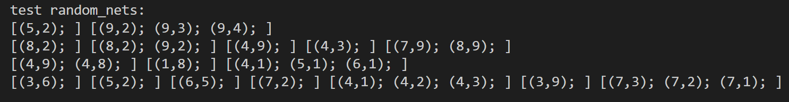
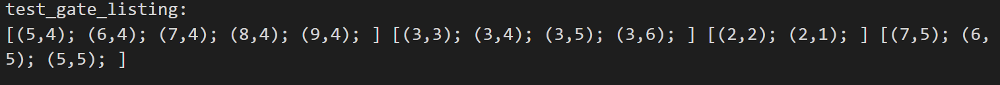
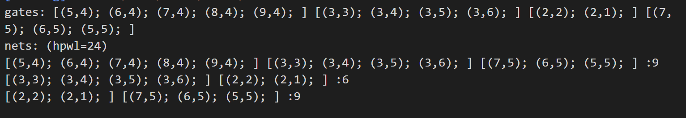
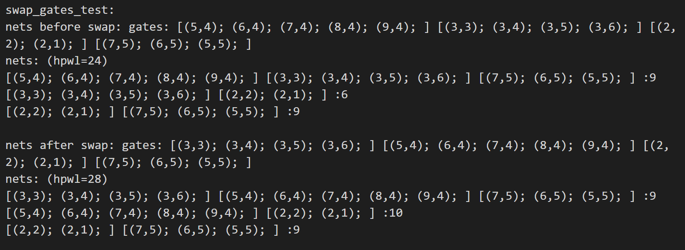
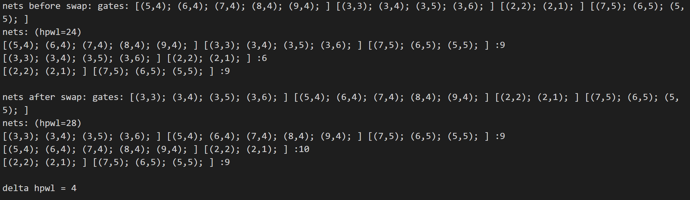
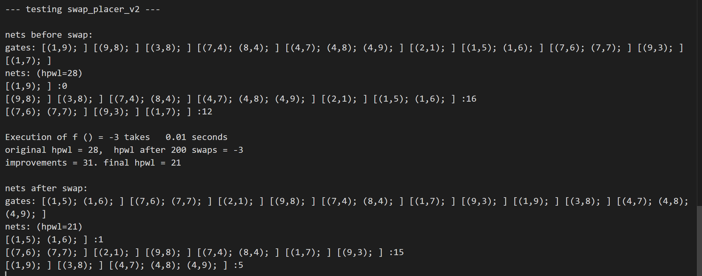
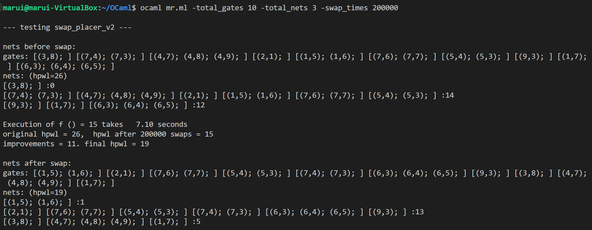

[TOC]


# 南京航空航天大学《函数式语言程序设计》报告

* 姓名：马睿
* 班级：1619304
* 学号：161930131


## 数据结构类型定义

```ocaml
type tpGate = {
  mutable coord  : int * int;
  mutable width  : int;
  mutable direction: int;
  mutable nets   : tpNet list
}
and tpNet = {
   mutable gates  : tpGate list
 }

let empty_gate :tpGate = { 
  coord = (0,0);
  width = 0;
  direction = 0;
  nets  = []
}

let empty_net : tpNet = {
  gates = []
}
```

在原先的`tpGate`的结构上，添加了`width` 和 `direction`字段。

其中`width` 表示`gate`的宽度，如果一个`gate`包含n个标准`gate`，那么它的宽度就是n - 1。

`direction`表示这一组`gate`的方向。

| direction: int | width | coord  | 解释                                  |
| -------------- | ----- | ------ | ------------------------------------- |
| 0              | 0     | (x, y) | 只有一个标准gate，坐标在(x, y)        |
| 1              | n     | (x, y) | 以(x, y)为起点，在上面还有n个标准gate |
| 2              | n     | (x, y) | 以(x, y)为起点，在下面还有n个标准gate |
| 3              | n     | (x, y) | 以(x, y)为起点，在右面还有n个标准gate |
| 4              | n     | (x, y) | 以(x, y)为起点，在左面还有n个标准gate |


## 网表生成函数

```ocaml
let gate2pair_list (gate:tpGate) : (int * int) list = 
  let rec gate2pair_list' i j w dir result = 
    if w < 0 then result
    else gate2pair_list' (i+directions.(dir).(0)) (j+directions.(dir).(1)) (w-1) dir ((i, j)::result)
    in gate2pair_list' (fst (fst gate)) (snd (fst gate)) (fst (snd gate)) (snd (snd gate)) []

(* create a hash table from gate coordinates to indexes. *)
let pair_hash (pair_list:(int * int) list) (flag: bool) : pairExist =
  let pairs = List.map (fun x -> ((fst x, snd x), flag)) pair_list in
    Hashtbl.of_seq (List.to_seq pairs)

let add_keys_datas2pair_hash (pe: pairExist) (pair_list:(int * int) list) (flag:bool) = 
  let add_key_data2pair_hash pair = 
    Hashtbl.add pe (fst pair, snd pair) flag
  in
  List.iter add_key_data2pair_hash pair_list

let update_keys_datas2pair_hash (pe: pairExist) (pair_list:(int * int) list) (flag:bool) = 
  let update_key_data2pair_hash pair = 
    Hashtbl.replace pe (fst pair, snd pair) flag
  in
  List.iter update_key_data2pair_hash pair_list

let pairs_exist (pair_list: (int*int) list) (pe: pairExist):bool =
  let pair_exist (p:int * int) :bool = 
    try Hashtbl.find pe (fst p, snd p) with _ -> false
  in
  let rec pairs_exist' pair_list' = 
    match pair_list' with
    | [] -> false
    | p::rest -> if pair_exist p then false else pairs_exist' rest
  in pairs_exist' pair_list

let gate_legal (gate:tpGate) (pe: pairExist) : bool =
  let ((x,y), (w, dir)) = gate in
  if (dir = 1 || dir = 2) && (x + directions.(dir).(0) * w) < 0 then false 
  else if (dir = 3 || dir = 4) && (y + directions.(dir).(1) * w) < 0 then false
  else not (pairs_exist (gate2pair_list gate) pe)

let random_w_dir (): int*int = 
  let random_width = (Random.int 3) and random_direction = (Random.int 4) in
  if random_width = 0 || random_direction = 0 then (0, 0)
  else (random_width, random_direction)

let rec random_gate (gate_bound:int) (pe: pairExist) : tpGate = 
  let random_width, random_direction = random_w_dir() in
  let (x, y) = random_coord gate_bound in 
  let gate = ((x, y), (random_width, random_direction)) in 
  let legal = gate_legal gate pe in
  if legal = true then gate
  else random_gate gate_bound pe
;;

(* let random_gate (gate_bound:int) : tpGate = 
  (random_gate_id gate_bound, random_gate_id gate_bound)
;; *)

let rec random_ary_ave (ave:int) (length:int) (aveary:int list) : int list =
  if length>0 then
  (
    let tm = Random.float 1. in
      if tm > 0.9 then 
      let nownum = Random.int length in
        random_ary_ave ave (length-1) (nownum::aveary)
      else 
      let nownum = (Random.int (2*ave-2)) +2 in
        random_ary_ave ave (length-1) (nownum::aveary)
  )
  else aveary

let random_net (gate_bound:int) (pe: pairExist) (total_gates:int) : tpNet =
  (* a net has at least 2 gates *)
  let rec mk_net n result =
    if n=0 then result else
      let new_gate = (random_gate gate_bound pe) in
	if List.mem new_gate result
	then mk_net (n-1) result
        else begin
        add_keys_datas2pair_hash pe (gate2pair_list new_gate) true;
        mk_net (n-1) (new_gate::result)
        end
  in mk_net total_gates []
  
(* return a randomly generated nets, each net has at most gate_bound gates. *)
let rec random_nets (gate_bound:int) (pe: pairExist) (total_nets:int): tpNets =
  let avearyl = random_ary_ave 5 total_nets [] 
  in
  let rec mk_nets aar result =
    match aar with
    | x::ar -> mk_nets ar ((random_net gate_bound pe x):: result)
    | [] -> result
  in mk_nets avearyl []
```

在生成网表的时候，需要传入一个`HashTable`，这个`HashTable`记录的是(x, y)坐标处是否已经生成一个标准gate，如果有，则

存在`((x, y), true)`这一键值对，否则是`((x, y), false)` 或者 `(x, y)`这一键不存在。


在随机生成`gate`坐标的同时还要生成这组`gate`的宽度与方向。

因此，还需要判断生成的`gate`是否合法，如果因为方向和宽度导致这组`gate`中，有标准`gate`的横坐标/纵坐标为负值，那么需要舍弃这组随机生成的`gate`。

其次，如果生成的宽度为0或者方向为0，则说明生成了一个标准gate，要将其宽度和方向都设置为0。

最后，还要判断生成这组`gate`时，是否与已存在的`gate`重叠了，如果这一组`gate`中有一个标准`gate`与其他组的标准`gate`相重叠，则判定新生成的这组`gate`不合法。

如果最终新生成的这组`gate`合法，那么就将其加入到`net`中，并把它所包含的标准`gate`都在`HashTable`标记为`true`，表示已经生成了。


### 测试



没有重叠的部分。`[]`里的是一组标准`gate`


## 布局函数

### hpwl

```ocaml
module ListNetsMod = struct
type tpGate = (int * int) * (int * int)
type tpNet = tpGate list

type tpNets = tpNet list

let modify_coord2min_or_max ((x, y): int*int) (w:int) (dir:int) (min_or_max:int) : tpGate = 
  if min_or_max = 0 then (* if get min gate *)
    if dir = 2 || dir = 4 
      (* if direction is left or down, then get the min_gate and change the direction of original gate*)
      then ((x + directions.(dir).(0) * w, y + directions.(dir).(1)) * w, (w, dir - 1)) 
    else ((x, y), (w, dir))
  else
    if dir = 1 || dir = 3 (* if get min gate *)
    (* if direction is right or up *)
    then ((x + directions.(dir).(0) * w, y + directions.(dir).(1)) * w, (w, dir + 1))
    else ((x, y), (w, dir))

type tpGate2 = tpGate * tpGate

(* return lower left and uppper right coordinates for two nets. *)
(* 对于tpGate2而言 width和direction已经无意义了，因为已经求过min和max了 *)
let add_coord_left (gate2:tpGate2)  (gate:tpGate) : tpGate2 =
  let ((x,y), (w, dir)) = gate in
  let (((min_col, min_row), (min_w, min_dir)), ((max_col,max_row), (max_w, max_dir))) = gate2 in
  let ((min_x, min_y), (min_gate_w, min_gate_dir)) = modify_coord2min_or_max (x,y) w dir 0 in 
  let ((max_x, max_y), (max_gate_w, max_gate_dir)) = modify_coord2min_or_max (x,y) w dir 1 in 

  let min_col = min min_col min_y and max_col = max max_col max_y in
  let min_row = min min_x min_row and max_row = max max_x max_row in
  (((min_col,min_row),(0,0)),((max_col,max_row),(0,0)))

(* a version of hpwl avoiding the generation of intermediate lists. *)
let hpwl (net:tpNet) =
  let init = (((0,0), (0,0)), ((max_int,max_int), (0, 0))) in
  let (((min_col, min_row), (min_w, min_dir)), ((max_col,max_row), (max_w, max_dir))) =
    List.fold_left add_coord_left init net  in
    (max_col - min_col) + (max_row - min_row)

(* add the hpwl of a net to the accumulated hpwl*)

let add_net_hpwl (hpwl_sum:int) (net:tpNet) : int =
  hpwl_sum + (hpwl net)

(* total hpwl redefined without creating intermediate list. *)
let total_hpwl (nets:tpNets) : int =
  List.fold_left add_net_hpwl 0 nets
end

module M = ListNetsMod;;

let add_coord_left (gate2:M.tpGate2)  (gate:tpGate) : M.tpGate2 =
  M.add_coord_left gate2 (gate_coord gate)

(* hpwl calculation on new net,looks same as the old code, but types are different *)


let hpwl (net:tpNet) =
  let init = (((0,0), (0,0)), ((max_int,max_int), (0, 0))) in
  let (((min_col, min_row), (min_w, min_dir)), ((max_col,max_row), (max_w, max_dir))) =
    List.fold_left add_coord_left init net  in
    (max_col - min_col) + (max_row - min_row)
```

在原先代码的基础上，将`add_coord_left`修改为了`add_gate_left`，并添加了`modify_coord2min_or_max`函数。在`module ListNetsMod`中，用之前求得的最大/最小行/列坐标，和当前的`gate`进行比较。


`modify_coord2min_or_max`函数是用来计算出一组`gate`的最大/最小行/列坐标。如果是求最小行/列坐标，那么需要判断当前这组`gate`的方向是否为下/左，如果为真，说明有对于当前`gate`的起点而言，有更小的坐标，需要根据`gate`的宽度计算相应坐标，然后返回对应的标准`gate`的坐标。注意：这里因为起点改变了，所以方向也要改变，下变上，左变右。

求最大行/列坐标同理。


`add_gate_left`函数将之前求得的最大/最小行/列坐标与`modify_coord2min_or_max`的结果做对比，得到新的最大/最小行/列坐标。对于这个新的结果而言，方向和宽度已经无所谓了，因为它已经是最大/最小了，不需要用到方向和宽度这两个参数了。


`hpwl`函数只需要将`init`添加宽度和方向两个参数即可。


### total_hpwl & net_hpwl

```ocaml
let gate_coord (gate:tpGate) = (gate.coord, (gate.width, gate.direction))

(* return the list of gate coordinates of a net. *)
let gate_coords_of_net (net:tpNet) : M.tpNet =
    List.map gate_coord net.gates
;;


(* return all gate coordinates of all nets. *)
let gates_of_net_ary (net_ary:tpNetAry) : M.tpNets =
  Array.to_list (Array.map gate_coords_of_net net_ary)

(* convert gate array to list of gates. *)
let gates_of_gate_ary (gate_ary:tpGateAry) : M.tpGate array =
  (Array.map gate_coord gate_ary)

(* return the gates in the gate_ary, and the gate list in all nets. *)
let recover_netlist (nets:tpNetList) : M.tpGate array * M.tpNets =
  let gate_ary,net_ary = nets in
  let mgate_ary  = gates_of_gate_ary gate_ary in
  let mnets      = gates_of_net_ary net_ary in
    mgate_ary,mnets

let recover_mnets (netlist:tpNetList) : M.tpNets =
  let _, nets = recover_netlist netlist  in nets
;;

(* calculate half length wire length hpwl of tpNetList. *)
let total_hpwl (netlist:tpNetList) : int =
  M.total_hpwl (recover_mnets netlist)

let net_hpwl (net:tpNet) : int =
  M.hpwl (gate_coords_of_net net);;
  
(* add the hpwl of a net to the accumulated hpwl*)
let add_net_hpwl (hpwl_sum:int) (net:tpNet) : int =
  hpwl_sum + (hpwl net)

(* total hpwl redefined without creating intermediate list. *)
let nets_hpwl (nets:tpNet list) : int =
  List.fold_left add_net_hpwl 0 nets
```

仅需要修改`gate_coord`即可。


## MakeNet

```ocaml
(* return a gate array from a nets. *)
let gate_ary_from_nets (nets:M.tpNets) : tpGateAry =
  let gate_list = M.all_gates nets in
  let gate_list  = List.map pair2gate gate_list in
    Array.of_list gate_list

(** create a hash table from gate coordinates to gate indexes. **)

type tpGateHash = ((int * int) * (int * int), int) Hashtbl.t
(* type tpGateHash = (int*int,int) Hashtbl.t *)
(* create a hash table from gate coordinates to indexes. *)
let gate_hash (gate_ary:tpGateAry) : tpGateHash =
  let gate_without_net_list = Array.mapi (fun i x -> ((x.coord, (x.width, x.direction)),i)) gate_ary in
    Hashtbl.of_seq (List.to_seq (Array.to_list gate_without_net_list))

(* convert a net of gate coordinates to a net of gate indexes. *)
let mk_net (net:M.tpNet) (gh:tpGateHash) (gate_ary:tpGateAry) :tpNet =
  let fd_gate_id ((i,j), (w, dir)) : tpGate = 
    gate_ary.(Hashtbl.find gh ((i,j), (w, dir)))
  in
    { gates = (List.map fd_gate_id net) }

let mk_net_ary (nets:M.tpNets) (gh:tpGateHash) (gate_ary:tpGateAry) : tpNetAry =
  let mk_net net = mk_net net gh gate_ary in
    Array.of_list (List.map mk_net nets)

(* update the nets components of the gate_ary by the net. *)
let update_gates_by_net (gate_ary:tpGateAry) (net:tpNet) : unit =
  let update_gate gate = 
    gate.nets <- net::gate.nets
  in
    List.iter update_gate net.gates


(* update the nets components of the gate_ary by iterating through net array. *)
let update_nets_in_all_gates 
    (gate_ary:tpGateAry) (net_ary:tpNetAry) : unit =
  let update_net net = update_gates_by_net gate_ary net in
    Array.iter update_net net_ary

(* convert a list net to array gates and nets. *)
let mk_netlist ?(gate_ary=[||]) (nets : M.tpNets) : tpNetList =
  let gate_ary   = 
    if gate_ary = [||]
    then gate_ary_from_nets nets 
    else gate_ary
  in
  let gh         = gate_hash gate_ary in
  let net_ary    = mk_net_ary nets gh gate_ary in
    update_nets_in_all_gates gate_ary net_ary;
    gate_ary, net_ary
```

修改`tpGateHash` ` gate_hash`  ` mk_net` 中的数据类型即可，将原先的`int * int`改为`(int * int) * (int * int)`


## 输出函数

### pair2str

```ocaml
let pair2str ((i, j), (w, dir)): string = 
  let rec pair2str' i j w dir result =
    if w < 0 then result
    else pair2str' (i+directions.(dir).(0)) (j+directions.(dir).(1)) (w-1) dir ((sprintf "(%i,%i) " i j) ^ result)
  in pair2str' i j w dir ""
```

原先每个`gate`只有一个坐标，所以直接输出即可。现在一个`gate`中可能有多个标准`gate`，所以需要递归输出：从起点出发，根据宽度逐个输出


#### 测试

```ocaml
let g1 = ((3,3), (3, 1))  (* up (3,3); (3,4); (3,5); (3,6) *)
let g2 = ((2,2), (1, 2))  (* down (2,2); (2,1);*)
let g3 = ((5,4), (4, 3))  (* right (5,4); (6,4); (7,4); (8,4); (9,4);*)
let g4 = ((7,5), (2, 4))  (* left (7,5); (6,5); (4,5) *)

(* swap  g1 and g2 *)

let net_i :M.tpNet = [g3;g1;g4]
let net_j :M.tpNet = [g1;g2]
let net_k :M.tpNet = [g2;g4] 
let three_nets : M.tpNets = [net_i;net_j;net_k] 
;;

three_nets;;
(* [[(1, 4); (3, 3); (4, 5)]; [(3, 3); (2, 1)]; [(2, 1); (4, 5)]] *)

let new_three_nets = mk_netlist three_nets;;

(* test by listing all gate coordinates. *)
let test_gate_listing () = 
  let gate_ary, net_ary = new_three_nets in
  let ng0 = (gate_ary.(0).coord, (gate_ary.(0).width, gate_ary.(0).direction)) in
  let ng1 = (gate_ary.(1).coord, (gate_ary.(1).width, gate_ary.(1).direction)) in
  let ng2 = (gate_ary.(2).coord, (gate_ary.(2).width, gate_ary.(2).direction)) in
  let ng3 = (gate_ary.(3).coord, (gate_ary.(3).width, gate_ary.(3).direction)) in
    [ng0;ng1;ng2;ng3];;
let test' = test_gate_listing ();;

print_endline "test_gate_listing";;
List.map print_string (List.map M.gate2str test');;
print_endline "\n";;
```




结果正确


### gate2str

```ocaml
let gate2str (g:tpGate) = pair2str (gate_coord g)

let gates2str (gates:tpGate list) : string =
  List.fold_left (^) "" (List.map gate2str gates)

let gate_ary2str (gate_ary:tpGateAry) : string =
  gates2str (Array.to_list gate_ary)

let net2str (net:tpNet) : string = 
  sprintf "%s:%i" (gates2str net.gates) (net_hpwl net)

let net_ary2str (net_ary:tpNetAry) : string =
  let net2str net = (net2str net)^"\n" in
  let nets = Array.to_list net_ary in
  List.fold_left (^) "" (List.map net2str nets )    

(* main netlist state priting function. *)
let netlist2str (netlist:tpNetList) : string =
  let gate_ary, net_ary = netlist in
  let gate_ary_str = gate_ary2str gate_ary in
  let net_ary_str  = net_ary2str  net_ary in
  let netlist_hpwl = total_hpwl netlist in
    sprintf "gates: %s\nnets: (hpwl=%i)\n%s\n" 
      gate_ary_str netlist_hpwl net_ary_str
;;
let pr_new_three_nets ?(msg="") () =
  printf "%s%s" msg (netlist2str new_three_nets);;
pr_new_three_nets () ;;
```

无需修改之前的代码


#### 测试

```ocaml
let pr_new_three_nets ?(msg="") () =
  printf "%s%s" msg (netlist2str new_three_nets);;
pr_new_three_nets () ;;
```



正确。


## swap_gate

```ocaml
let swap_gates (g1:tpGate) (g2:tpGate) : unit = 
  begin
    let x1 = fst g1.coord and y1 = snd g1.coord and w1 = g1.width and dir1 = g1.direction 
    and x2 = fst g2.coord and y2 = snd g2.coord and w2 = g2.width and dir2 = g2.direction 
    in
    let gate1_pair_list = M.gate2pair_list ((x1, y1), (w1, dir1)) 
    and gate2_pair_list = M.gate2pair_list ((x2, y2), (w2, dir2)) 
    and swaped_gate1 = ((x2, y2), (w1, dir1))
    and swaped_gate2 = ((x1, y1), (w2, dir2))
    in
    M.update_keys_datas2pair_hash pe gate1_pair_list false;
    M.update_keys_datas2pair_hash pe gate2_pair_list false;
    if (M.gate_legal swaped_gate2 pe) && (M.gate_legal swaped_gate1 pe) then 
      begin
        let coord = g1.coord in
          g1.coord <- g2.coord;
          g2.coord <- coord;
          
        let width = g1.width in
          g1.width <- g2.width;
          g2.width <- width;
          
        let direction = g1.direction in
          g1.direction <- g2.direction;
          g2.direction <- direction;
          M.update_keys_datas2pair_hash pe (M.gate2pair_list swaped_gate1) true;
          M.update_keys_datas2pair_hash pe (M.gate2pair_list swaped_gate2) true;
      end
    else 
      begin
        M.update_keys_datas2pair_hash pe gate1_pair_list true;
        M.update_keys_datas2pair_hash pe gate2_pair_list true;
      end
  end;;

(* swap gates test *)
let swap_gates_test ?(i=0) ?(j=1) (nets:tpNetList) =
  let gate_ary,net_ary = nets in
    pr_new_three_nets ~msg:"nets before swap: " ();
  let gi = gate_ary.(i) and gj = gate_ary.(j) in
  let _ = swap_gates new_three_nets gi gj in
    pr_new_three_nets ~msg:"nets after swap: " ();;


swap_gates_test new_three_nets;;
```

在该程序中，交换两个`gate`时，是从他们的起点互相交换，保持其各自的方向和宽度。

因此，在交换`gate`时，先将两个`gate`所占据的标准`gate`在哈希表中全部设置为`false`，表示这里没有`gate`，可以进行放置。然后判断交换后的两组`gate`所在的位置是否合法，如果合法，那么将其交换，更新哈希表；否则不交换，并把哈希表中的`gate`还原。


### 测试

```ocaml
(* swap gates test *)
let swap_gates_test ?(i=0) ?(j=1) (nets:tpNetList) =
  let gate_ary,net_ary = nets in
    pr_new_three_nets ~msg:"nets before swap: " ();
  let gi = gate_ary.(i) and gj = gate_ary.(j) in
  let _ = swap_gates new_three_nets gi gj in
    pr_new_three_nets ~msg:"nets after swap: " ();;

print_endline "swap_gates_test: ";;
swap_gates_test new_three_nets;;
print_endline "\n";;
```


正确




## swap_gates_hpwl

```ocaml
(* recover net *)
let recover_nets (nets:tpNet list) : M.tpNet list =
  List.map gate_coords_of_net nets

(* convert swap gates, delta_hpwl and db to string. *)
let spr_swap_gates_db ?(msg="") 
    (g1:tpGate) (g2:tpGate) (hpwl:int) db : string =
  let g1s = gate2str g1 and g2s = gate2str g2 in
    sprintf "%s swap gates %s %s, hpwl=%i, nets=\n%s\n"
      msg g1s g2s hpwl (netlist2str db)
  
(* print status before and after gate swap. *)
let pr_gate_swap_status ?(msg="") 
    (g1:tpGate) (g2:tpGate) (hpwl:int) db =
    print_endline 
      (spr_swap_gates_db ~msg g1 g2 hpwl db)

(** HPWL v 4.0 -- direct HPWL calculation on new nets **)

(* return lower left and uppper right coordinates for two nets. *)
let add_coord_left (gate2:M.tpGate2)  (gate:tpGate) : M.tpGate2 =
  M.add_coord_left gate2 (gate_coord gate)

(* hpwl calculation on new net,looks same as the old code, but types are different *)

let hpwl (net:tpNet) =
  let init = (((max_int,max_int), (0, 0)), ((0,0), (0,0))) in
  let (((min_col, min_row), (min_w, min_dir)), ((max_col,max_row), (max_w, max_dir))) =
    List.fold_left add_coord_left init net.gates  in
    (max_col - min_col) + (max_row - min_row)


(* add the hpwl of a net to the accumulated hpwl*)
let add_net_hpwl (hpwl_sum:int) (net:tpNet) : int =
  hpwl_sum + (hpwl net)

(* total hpwl redefined without creating intermediate list. *)
let nets_hpwl (nets:tpNet list) : int =
  List.fold_left add_net_hpwl 0 nets

(* swap gates and return the change of hpwl. *)
let swap_gates_hpwl ?(debug_on=false) 
    (db:tpNetList) (g1:tpGate) (g2:tpGate) : int =
  let n1 = g1.nets and n2 = g2.nets in
  let hpwl_before  = (nets_hpwl n1)+(nets_hpwl n2) in
    if debug_on then begin
      pr_gate_swap_status 
	~msg:"swap_gates_hpwl: before " g1 g2 hpwl_before db;
    end;
    swap_gates db g1 g2;
    let hpwl_after  = (nets_hpwl n1)+(nets_hpwl n2) in
    if debug_on then
      pr_gate_swap_status 
	~msg:"swap_gates_hpwl: after " g1 g2 hpwl_after db;
      hpwl_after - hpwl_before
```

无需修改之前的代码

### 测试

```ocaml
let swap_gates_hpwl_test ?(debug_on=false) 
    ?(i=0) ?(j=1) (nets:tpNetList) =
  let gate_ary,net_ary = nets in
    pr_new_three_nets ~msg:"nets before swap: " ();
  let gi = gate_ary.(i) and gj = gate_ary.(j) in
  let delta_hpwl = swap_gates_hpwl ~debug_on new_three_nets gi gj in
    pr_new_three_nets ~msg:"nets after swap: " ();
    printf "delta hpwl = %i\n" delta_hpwl
;;
swap_gates_hpwl_test new_three_nets;;
```



正确。


## 布局算法

```ocaml
(* print status during placer internel iterations. *)
let pr_netlist_status ?(msg="") i j delta_hpwl db =
  if msg="" then
    printf "exchange %i %i, delta=%i\nnetlist:\n%s\n" 
      i j delta_hpwl (netlist2str db)
  else 
    printf "%s %i %i, delta=%i\nnetlist:\n%s\n" 
      msg i j delta_hpwl (netlist2str db)

(* iterating for at most n times if no improvement, return 
   the final placement and the initial and final hpwls. 
   n times of initial random swaps 
   no debug code.
*)
let swap_placer_v2
    (nets:M.tpNets) (uplimit:int) : tpNetList * int * int =
  let db : tpNetList = mk_netlist nets in
  let gate_ary,net_ary = db in
  let total_gates = Array.length gate_ary in
  let initial_hpwl   = total_hpwl db in
  let rec rp db delta_hpwl n =
    if n>=uplimit
    then db,initial_hpwl, (initial_hpwl+delta_hpwl) 
    else 
      let i,j = two_random_ints total_gates in
      let g1 = gate_ary.(i) and g2 = gate_ary.(j) in
      let delta = swap_gates_hpwl  db g1 g2 in  
	begin
	  if delta>=0
	  then (* recover previous db *)
	    let _ = swap_gates_hpwl db g2 g1 in	    
	      rp db delta_hpwl (n+1)
	  else rp db (delta_hpwl+delta) (n+1)
	end
  in 
    rp db 0 0
;;

three_nets;;
let placed_three_nets,init_hpwl, final_hpwl = 
  swap_placer_v2  three_nets 2
in
  init_hpwl, final_hpwl, recover_mnets placed_three_nets;;


(* output the updated nets so that it can be called in calc_in_time *)


(** timing calculation and testing scripts adapted from lec04.ml **)

(* calculate the computation time of executing a function. *)
let calc_int_time (f : int -> int*'a) (n:int) : int * 'a =
  let start_time = Sys.time () in
  let hpwl_val, nets = f n in
  let end_time = Sys.time () in
  let elapsed = end_time -. start_time in
    printf "Execution of f () = %i takes %6.2f seconds\n" 
      hpwl_val elapsed;
    hpwl_val, nets


(* swap placer test v 2.0  is form command level test. *)
let test_swap_placer_on_nets swap_placer total_hpwl nets swap_times =
  let hpwl_val = total_hpwl nets in
  let swap_placer swap_times = swap_placer nets swap_times in
  let i,new_nets = calc_int_time swap_placer swap_times in
    printf "original hpwl = %i,  hpwl after %i swaps = %i\n" 
      hpwl_val swap_times i;
    printf "improvements = %i. " (hpwl_val-i);
    printf "final hpwl = %i\n" (total_hpwl new_nets)
;;


let placer_test_v2 (nets:M.tpNets)  swap_times =
  let swap_placer nets n =
    let new_nets,_,final_hpwl = swap_placer_v2 nets n in
      final_hpwl, (recover_mnets new_nets)
  in
    test_swap_placer_on_nets swap_placer M.total_hpwl nets swap_times


(** placement initialization **)

(* the input to the placer is a list of nets, each net is
   a list of integers, each integer is the id of a gate. *)
type tpInputNet = int list
type tpInputNetList = tpInputNet list
```

无需修改之前的代码


## 主函数

```ocaml
let pe = M.pair_hash [] true;;

(* calculate the computation time of executing a function. *)
let calc_int_time (f : int -> int*'a) (n:int) : int * 'a =
  let start_time = Sys.time () in
  let hpwl_val, nets = f n in
  let end_time = Sys.time () in
  let elapsed = end_time -. start_time in
    printf "Execution of f () = %i takes %6.2f seconds\n" 
      hpwl_val elapsed;
    hpwl_val, nets


(* swap placer test v 2.0  is form command level test. *)
let test_swap_placer_on_nets swap_placer total_hpwl nets swap_times =
  let hpwl_val = total_hpwl nets in
  let swap_placer swap_times = swap_placer nets swap_times in
  let i,new_nets = calc_int_time swap_placer swap_times in
    printf "original hpwl = %i,  hpwl after %i swaps = %i\n" 
      hpwl_val swap_times i;
    printf "improvements = %i. " (hpwl_val-i);
    printf "final hpwl = %i\n" (total_hpwl new_nets);
    print_endline "\nnets after swap:";
    printf "%s" (netlist2str (mk_netlist new_nets));
;;


let placer_test_v2 (nets:M.tpNets)  swap_times =
  let swap_placer nets n =
    let new_nets,_,final_hpwl = swap_placer_v2 nets n in
      final_hpwl, (recover_mnets new_nets)
  in
    test_swap_placer_on_nets swap_placer M.total_hpwl nets swap_times


(** placement initialization **)

(* the input to the placer is a list of nets, each net is
   a list of integers, each integer is the id of a gate. *)
type tpInputNet = int list
type tpInputNetList = tpInputNet list

(* placement with automatically calculated square size. *)


let debug_on = ref false


(** command option processing **)

(* global variables for command options. *)
let cmdopt_total_gates : int ref = ref 10
let cmdopt_total_nets :int ref = ref 5
let cmdopt_swap_times : int ref = ref 200

(* global variable setting functions. *)
let set_total_gates (i:int)   =  cmdopt_total_gates := i
let set_total_nets (i:int)    =  cmdopt_total_nets  := i
let set_swap_times (i:int)    =  cmdopt_swap_times  := i
let set_debug_on ()           =  debug_on := true


let read_options () : string =
  let speclist =
    [ 
      ("-total_gates",   Arg.Int set_total_gates,"Total gates in a net");
      ("-total_nets", Arg.Int set_total_nets, "Total number of nets");
      ("-swap_times", Arg.Int set_swap_times, "Total number of gate swaps");
      ("-debug_on",   Arg.Set debug_on, "Enable debug information output");
    ]
  in
  let usage_msg = "Usage: ./placer [option] where options are:" in
  let _ = Arg.parse speclist (fun s -> ()) usage_msg in
    ""


let main () =
  let _ = read_options () in 
  let gate_bound = !cmdopt_total_gates in
  let total_nets = !cmdopt_total_nets in
  let swap_times = !cmdopt_swap_times in 
  let nets = M.random_nets gate_bound pe total_nets in 
  let new_nets = mk_netlist nets in
	print_endline "\n--- testing swap_placer_v2 ---";
  print_endline "\nnets before swap:";
  printf "%s" (netlist2str new_nets);
	placer_test_v2 nets  swap_times
;;

main ();;
```

要设置一个全局哈希表，用以对网表的每个标准`gate`是否存在覆盖情况作以判断。初始哈希表不存在Key。


无参数运行结果：




带参数运行结果：



结果正确。